<div align="center">



<br />

<a href="https://abhi-vit.github.io/Profile/"></a>
<a href="https://www.linkedin.com/in/abhipy/"></a>
<a href="mailto:abhishek.k.jalandhar@gmail.com"></a>
<a href="https://leetcode.com/u/ft31DEgRSt/"></a>
<a href="https://raw.githubusercontent.com/Abhi-VIT/Profile/main/Resume.pdf"></a>

<br /><br />

<samp>M.Sc. Data Science @ VIT-AP · IEEE Published Researcher · TCS Digital (AI Cloud) Selectee</samp>

</div>

## About me

I build end-to-end data products - from cleaning messy inputs and engineering features to training models, designing analytics, and shipping usable interfaces. My work sits at the intersection of **machine learning**, **deep learning**, **knowledge graphs**, and **decision-focused analytics**.

```python
abhishek = {
    "role": "AI-Powered Data Insights Intern @ TOEHO AI",
    "building": ["ML platforms", "knowledge graphs", "analytics dashboards"],
    "exploring": ["LLMs", "RAG pipelines", "production ML"],
    "open_to": "Data Science and ML Engineering opportunities",
}
```

## What I'm working on

- **AI-powered data insights:** extracting and analyzing signals from social media and news sources at TOEHO AI.
- **No-code machine learning:** making data cleaning, feature engineering, visualization, and model training more accessible.
- **Connected knowledge:** combining web crawling, graph architecture, and relevance ranking for guided learning.
- **Applied research:** studying how learning rates, optimizers, and activation functions interact during CNN training.

## Featured work

<table>
  <tr>
    <td width="50%" valign="top">
      <h3>🕸️ <a href="https://github.com/Abhi-VIT/Graph-Net">Graph Net</a></h3>
      <p>An intelligent knowledge-graph application that combines web search, NLP, Gemini-powered summaries, and interactive concept relationships.</p>
      <p><code>Python</code> <code>Django</code> <code>NetworkX</code> <code>Gemini</code> <code>NLP</code></p>
    </td>
    <td width="50%" valign="top">
      <h3>🧩 <a href="https://github.com/Abhi-VIT/ARG-data-and-Modeling">ARG Data &amp; Modeling</a></h3>
      <p>A no-code data science platform with drag-and-drop workflows for preprocessing, visualization, feature engineering, and model training.</p>
      <p><code>TensorFlow</code> <code>PyTorch</code> <code>Pandas</code> <code>NumPy</code></p>
    </td>
  </tr>
  <tr>
    <td width="50%" valign="top">
      <h3>🧬 <a href="https://github.com/Abhi-VIT/Drug-module-generation">Molecular Generation</a></h3>
      <p>A graph-based generative system using a variational autoencoder and relational graph convolutions to generate valid drug-like molecules.</p>
      <p><code>VAE</code> <code>R-GCN</code> <code>Deep Learning</code> <code>ZINC</code></p>
    </td>
    <td width="50%" valign="top">
      <h3>🏥 <a href="https://github.com/Abhi-VIT/Healthcare-Appointment-App">Healthcare Appointment App</a></h3>
      <p>A patient-centered booking experience redesigned around clearer navigation, stronger calls to action, and improved accessibility.</p>
      <p><code>HTML</code> <code>CSS</code> <code>UX</code> <code>Accessibility</code></p>
    </td>
  </tr>
</table>

## Research spotlight

> **Investigating the Synergistic Effects of Learning Rate, Optimizer, and Activation Function on Convolutional Neural Network Training**

Published at the **2025 IEEE 5th International Conference on Artificial Intelligence and Signal Processing**. The work compares optimizer and activation-function combinations with dynamic learning-rate tuning to study CNN convergence, stability, and generalization.

<a href="https://ieeexplore.ieee.org/document/11396244"></a>

## Technical toolkit

<div align="center">

**Languages**


**Machine learning & data**


**Platforms & engineering**


<br />

`Pandas` · `NumPy` · `Matplotlib` · `Seaborn` · `Tableau` · `Power BI` · `Streamlit` · `Neo4j` · `Jupyter` · `OCI`

</div>

## Milestones

| | Highlight |
|---|---|
| 🎓 | **M.Sc. Data Science**, Vellore Institute of Technology - AP (2024-2026) |
| 🏆 | Qualified TCS NQT aptitude and coding rounds; selected for **TCS Digital - AI Cloud** |
| ☁️ | **Oracle Cloud Infrastructure 2025 Generative AI Professional** |
| 📊 | **AWS Cloud Essentials** and Accenture Data Analytics &amp; Visualization simulation |
| 🧠 | Advanced Machine Learning certification from **NIT Warangal** |

## GitHub at a glance

<div align="center">


<br />


</div>

---

<div align="center">

### Let's build something useful with data.

I'm open to **Data Science**, **Machine Learning**, and **Analytics** opportunities, as well as research and open-source collaborations.

<a href="mailto:abhishek.k.jalandhar@gmail.com"><strong>Start a conversation →</strong></a>

<br /><br />

<sub>Designed with curiosity, evidence, and a bias toward building.</sub>

</div>
